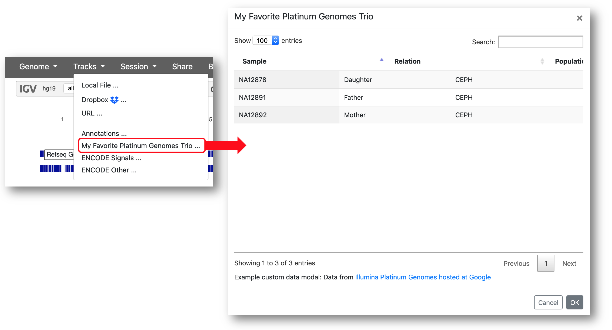

[](https://github.com/igvteam/igv-webapp)

# IGV-Web App

The IGV-Web app is a pure-client "genome browser" application based on [igv.js](https://github.com/igvteam/igv.js).  It is developed by the [Integrative Genomics Viewer (IGV)](https://igv.org) team. You can use our hosted app at https://igv.org/app, or follow the directions below to install your own.

Note:  the instructions below are **for developers or others wishing to install a copy of the IGV-Web app.**  For documentation about _using the app_, see [https://igvteam.github.io/igv-webapp/](https://igvteam.github.io/igv-webapp/). A link to the user documentation is also provided in the app's Help menu.

## Supported Browsers

The IGV-Web app and igv.js require a modern web browser with support for JavaScript ECMAScript 2015.

## Installation

IGV-Web is a pure client web application consisting entirely of static files and can be served from virtually any 
web server, e.g.  Apache, Flask, Tomcat, nginx, or Amazon S3. You can install it from the pre-built IGV-Web distribution package or by building it from source code. To run the app, refer to your web server documentation for information on serving web content. Some examples are provided 
in the section on **Running the app** below.

### Option 1: Download a pre-built package

Zip files of the current and previous versions of the IGV-Web app are available for [download here](https://igv.org/app-archive).


### Option 2: Build from source code

* Pre-requisites
  * Node >= v16
  * NPM >= v5.6.0

* Get the source code either (a) by downloading a zip file via the green `Code` button at https://github.com/igvteam/igv-webapp, or (b) by cloning the repository: 
````
git clone https://github.com/igvteam/igv-webapp.git
````
* Change directories to project
````
cd ./igv-webapp
````
* Install
````
npm install
````
* Build. This step creates a `dist` directory with the same contents as the pre-built package.
````
npm run build
````

## Serving and running the app

As noted above, refer to your web server documentation for instructions on serving the web content.  As examples, 
instructions for use with the NPM package http-server and Amazon S3 follow.  

### Example 1: http-server

For more information about http-server, including installing it locally, see the [http-server documentation](https://www.npmjs.com/package/http-server).

* Start http-server and pass it the path to the built IGV-Web folder as a paramater. The folder is either the folder created when you downloaded the pre-packaged distribution described above, or it is the `dist` folder you built from the source code.
````
npx http-server -a localhost <IGV-Web folder>
````

* Open a browser and enter the following
````
localhost:8080
````
or
````
localhost:8080/index.html
````

### Example 2: Amazon S3

To serve the app from Amazon S3, simply upload the contents from the IGV-Web content folder (i.e., the pre-packaged distribution described above, or the `dist` folder if building from source ) to an Amazon S3 bucket.  Keep the 
directory structure intact, and make all files public. Example of an S3 hosted app is at  
https://s3.amazonaws.com/igv.org.app/app/index.html.   Note this is an example and is not kept up-to-date.


## Configuration

A number of IGV-Web app properties are customizable, and are configured through the global `igvwebConfig`, which is defined in the file `igvwebConfig.js`:

* **Configuring the _Genome_ dropdown menu.** The property `genomes` defines a URL to a JSON file containing a list of genome configuration objects used to populate the menu. For a description of the genome configuration object, see the [igv.js wiki](https://github.com/igvteam/igv.js/wiki/Reference-Genome) .  

* **Configuring the _Tracks_ dropdown menu to include pre-defined tracks.** The property `trackRegistryFile` defines a URL to a configuration file that contains a JSON object with genomeIDs as keys and an array of URLs to JSON files defining each menu item. Clicking on a menu item will open up a simple list of pre-defined tracks or an annotated table of pre-defined tracks.
The default track registry file is ```resources/tracks/trackRegistry.json```.  Further details on configuring the tracks menu are available [below](#track-registry).

* **Configuring properties of the IGV browser and default tracks** The `igvConfig` property is an igv.js configuration object.   See the [igv.js wiki](https://github.com/igvteam/igv.js/wiki/Browser-Creation) for details.

* **Enabling Dropbox access.** The property `dropboxAPIKey` (_optional_)  is a Dropbox "data-api-key" used to enable a Dropbox file picker in the Genome, Session, and 
Tracks menus.  See [https://www.dropbox.com/developers/apps/create](https://www.dropbox.com/developers/apps/create)
for instructions on obtaining an api key.  Note this is not needed to load dropbox files by URL, only for providing a 
file picker.

* **Enabling Google access.** The property `clientId` - (_optional_) is a Google clientId, used to enable OAuth for the Google picker in the Genome, Session, and Tracks menus, and for access to protected
Google resources.  See [Google Support](https://developers.google.com/identity/sign-in/web/sign-in) for
instructions on obtaining a clientId.  OAuth requests from igv.js will include the following scopes.

    * https://www.googleapis.com/auth/userinfo.profile - _always_
    * https://www.googleapis.com/auth/devstorage.read_only  - _if accessing protected Google Cloud Storage files_
    * https://www.googleapis.com/auth/drive.readonly - _if accessing files stored on Google Drive_
  
* **Enabling shortening of shared URLs.** The property `urlShortener` (_optional_) is an object or function defining a URL shortener to shorten links created by the **Share** button.  The [tinyURL](https://tinyurl.com/app/) service can be configured by entering an api token in the field of the default configuration.  Other providers can be supported by setting the ```urlShortener``` property to an async function taking a single argument (the long URL) and returning the shortened URL. 

### Where to find the configuration files

* If you installed a **pre-built** distribution package, the configuration files can be found in the ```resources``` folder. 
* In the **the source code**, you will find the configuration files in the ```resources``` folder, but to deploy any changes you make there, you must rebuild the `dist` folder with ``` npm run build```. Alternatively, you can just directly update files in ```dist/resources```; although any changes to files in ```dist``` will be overwritten the next time you do a build.

> NOTE: if you change the configuration files, you may need to clear the browser cache before seeing the effect.

### Default configuration

```javascript
var igvwebConfig = {

    genomes: "resources/genomes.json",
    trackRegistryFile: "resources/tracks/trackRegistry.json",
    sessionRegistryFile: "resources/sessions/sessionRegistry.json",

    // Supply a drobpox api key to enable the Dropbox file picker in the load menus.  This is optional
    //dropboxAPIKey: "...",

    // Supply a Google client id to enable the Google file picker in the load menus.  This is optional
    //clientId: "...",
    // apiKey: "...",

    // Provide a URL shorterner function or object.   This is optional.  If not supplied
    // sharable URLs will not be shortened.  If using tinyURL uncomment and supply an api token
    
    // urlShortener: {
    ///    provider: "tinyURL",
    //     api_token: "..."
    //},

    enableCircularView: true,

    restoreLastGenome: true,

    igvConfig:
        {
            genome: "hg19",
            locus: "all",
            genomeList: "resources/genomes.json",
            queryParametersSupported: true,
            showChromosomeWidget: true,
            showSVGButton: false,
            tracks: []
        }

}

```

### Track Registry

The set of pre-defined tracks presented in the _Tracks_ menu is different depending on the currently selected reference genome. The items presented in the menu are defined in the file specified by the `trackRegistryFile` property in _igvwebConfig.js_ by associating lists of track configuration files with genome IDs. 

The **example track registry file** below will result in two items for the _Tracks_ menu when the hg19 genome is selected, and a single menu item for hg38. **Note:** make sure to include the comma after every item in the list, except the last one.

```json
{
  "hg19" : [
    "resources/tracks/hg19_annotations.json", 
    "resources/tracks/hg19_my_platinum_genomes.json"
  ],

  "hg38" : [
    "resources/tracks/hg38_annotations.json"
  ]
}
```
Each .json **track configuration file** associated with a genome ID corresponds to one menu item presented in the _Tracks_ pulldown menu. The configuration file defines:

* The label of the item in the menu. 
* An optional description.
* The set of tracks presented for selection when the user clicks on the menu item. The tracks can be presented as 
	* a **simple list** of track names (default), 
	* or, an **annotated table of tracks**, defined inline in the JSON or in a separate file.  

**1. Simple list of track names.** The example below defines a menu item labeled "Annotations" that presents a list of just one track, a BED file of Gencode gene annotations. The details of the track are defined by a track configuration object as documented in the [igv.js wiki](https://github.com/igvteam/igv.js/wiki/Tracks-2.0).

```json
{
  "label": "Annotations",
  "description": "Annotations - source <a href=http://hgdownload.soe.ucsc.edu/downloads.html target=_blank>UCSC Genome Browser</a>",
  "tracks": [
	{
	  "type": "bed",
	  "url": "https://s3.amazonaws.com/igv.org.test/data/gencode.v18.collapsed.bed",
	  "indexURL": "https://s3.amazonaws.com/igv.org.test/data/gencode.v18.collapsed.bed.idx",
	  "name": "Gencode V18"
	}
  ]
}	
```
**2. Annotated table of tracks.** Setting a `type` property in the track configuration file to "custom-data-modal" specifies that a custom annotated table of tracks will be used. Each row in the table corresponds to a track, and columns represent attributes of the track. The resulting table can be sorted and filtered interactively by the user based on column values. Selecting a row in the table will load the corresponding track.  

The `data` property in the configuration file defines the attribute values for each row, and also the details of the track to be loaded when the row is selected. The track details are used to create a track configuration object as documented in the [igv.js wiki](https://github.com/igvteam/igv.js/wiki/Tracks-2.0). The `data` property can either point to an external tab- or comma-delimited file, or contain the data inline as JSON, as shown in the two examples below. The `columns` property in the configuration file defines which track attributes are displayed in the table. An optional `columnDefs` property can be used to rename the column headers displayed in the table.

The following example defines a menu item labeled "My Favorite Platinum Genomes Trio", sets the `type` property to "custom-data-modal", and defines the data for the table inline as JSON. The resulting table has 3 tracks and displays 3 attributes for each. The property `columnDefs` is used to set the displayed column heading for the track attribute "name" to "Sample". 
 
```json
{  
  "label": "My Favorite Platinum Genomes Trio",
  "type": "custom-data-modal",
  "description": "Example custom data modal: Data from <a href=https://cloud.google.com/genomics/docs/public-datasets/illumina-platinum-genomes target=_blank>Illumina Platinum Genomes hosted at Google</a>",

  "columns":
  [
    "name",
    "Relation",
    "Population"
  ],
  "columnDefs":
  {
    "name":
    {
      "title": "Sample"
    }
  },

  "data":
  [
    {
      "Relation": "Daughter",
      "Population": "CEPH",
      "sourceType": "gcs",
      "type": "alignment",
      "url": "gs://genomics-public-data/platinum-genomes/bam/NA12878_S1.bam",
      "indexURL": "gs://genomics-public-data/platinum-genomes/bam/NA12878_S1.bam.bai",
      "name": "NA12878"
    },
    {
      "Relation": "Father",
      "Population": "CEPH",
      "sourceType": "gcs",
      "type": "alignment",
      "url": "gs://genomics-public-data/platinum-genomes/bam/NA12891_S1.bam",
      "indexURL": "gs://genomics-public-data/platinum-genomes/bam/NA12891_S1.bam.bai",
      "name": "NA12891"
    },
    {
      "Relation": "Mother",
      "Population": "CEPH",
      "sourceType": "gcs",
      "type": "alignment",
      "url": "gs://genomics-public-data/platinum-genomes/bam/NA12892_S1.bam",
      "indexURL": "gs://genomics-public-data/platinum-genomes/bam/NA12892_S1.bam.bai",
      "name": "NA12892"
    }
  ]
}
```




The following example shows the track configuration file for the same menu item and table as the example above, but in this case the track details are in a tab or comma delimited file describing a table with column headers.  Each column header is mapped to a track configuration json property.  A ```url```
column is required to load the track.   The table file is specified with the "data" property, and can be either a relative local path or URL.   

```json
{  
  "label": "My Favorite Platinum Genomes Trio",
  "type": "custom-data-modal",
  "description": "Example custom data modal: Data from <a href=https://cloud.google.com/genomics/docs/public-datasets/illumina-platinum-genomes target=_blank>Illumina Platinum Genomes hosted at Google</a>",

  "columns":
  [
    "name",
    "Relation",
    "Population"
  ],
  "columnDefs":
  {
    "name":
    {
      "title": "Sample"
    }
  },
  "delimiter": ",",
  "data": "resources/tracks/my_custom_track_table.csv"
}
```
The `data` file can be tab- or comma-separated, specified by setting a `delimeter` property to "," or "\t". If the property is not set, the .csv or .tab filename extensions specify the file type. The file in this example is a .csv file. It has the same information as the JSON example above, but formatted as follows:

```
Relation,Population,sourceType,type,url,indexURL,name
Daughter,CEPH,gcs,alignment,gs://genomics-public-data/platinum-genomes/bam/NA12878_S1.bam,gs://genomics-public-data/platinum-genomes/bam/NA12878_S1.bam.bai,NA12878
Father,CEPH,gcs,alignment,gs://genomics-public-data/platinum-genomes/bam/NA12891_S1.bam,gs://genomics-public-data/platinum-genomes/bam/NA12891_S1.bam.bai,NA12891
Mother,CEPH,gcs,alignment,gs://genomics-public-data/platinum-genomes/bam/NA12892_S1.bam,gs://genomics-public-data/platinum-genomes/bam/NA12892_S1.bam.bai,NA12892
```

### Data Servers

IGV-Web uses igv.js, a JavasScript client. To host your own track data, note that the hosting server must support CORS access and Range requests.  See https://github.com/igvteam/igv.js/wiki/Data-Server-Requirements for more details.  


## License
The IGV-Web app is [MIT](/LICENSE) licensed.

