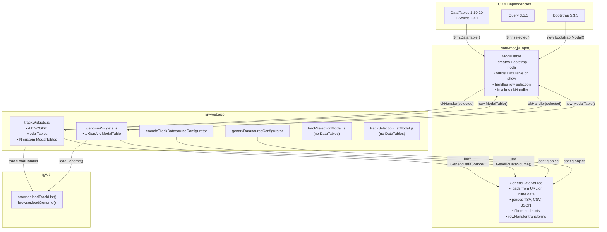
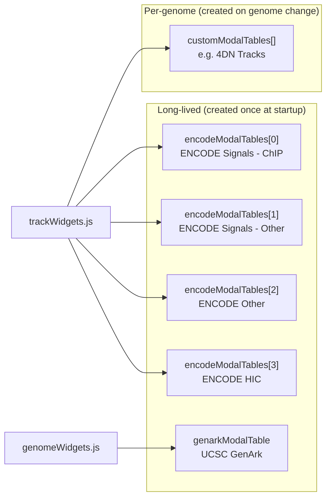
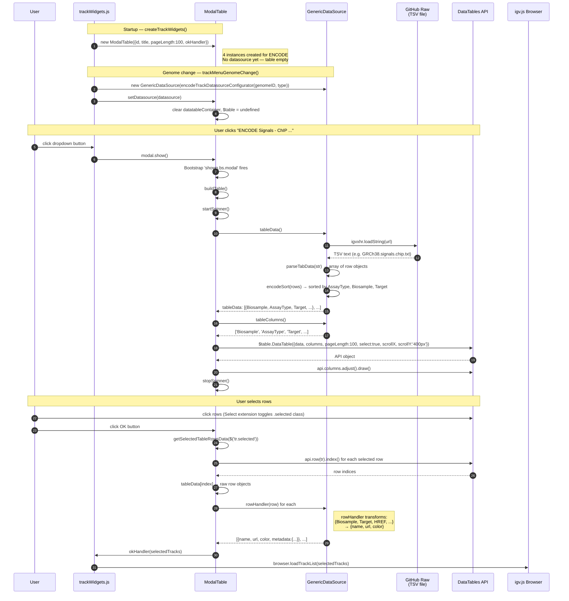
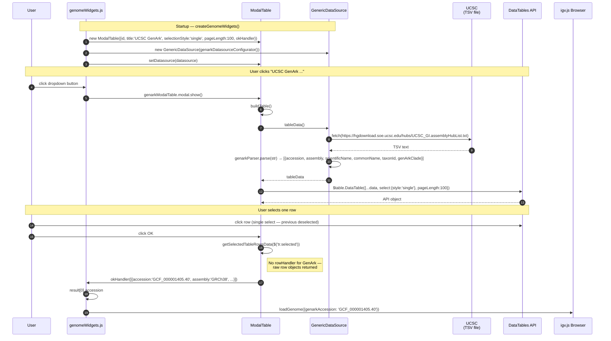
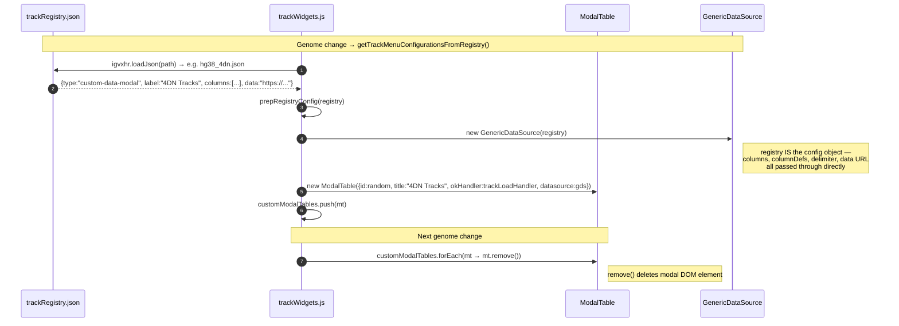
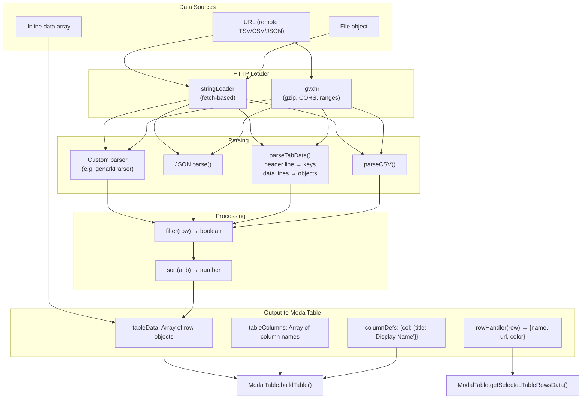
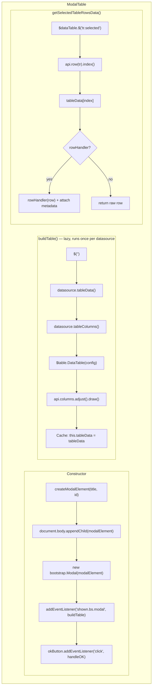
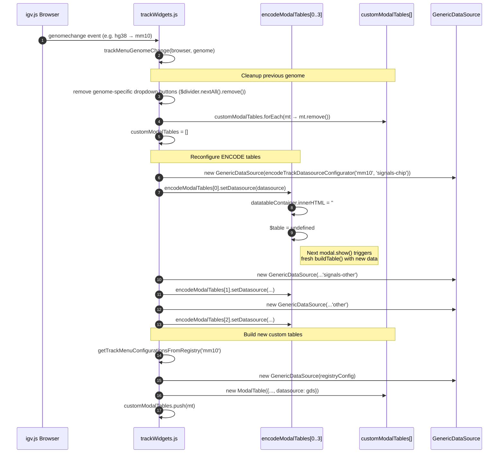

# igv-webapp ↔ DataTables Interaction Diagrams

How jQuery DataTables is used in igv-webapp, mediated by the **data-modal** wrapper library. The goal: replace DataTables (and eliminate the last jQuery dependency) with a custom table component.

---

## 1. Architecture Overview

Two completely separate modal systems coexist for track/genome selection. Only one depends on DataTables:

| Modal System | Library | Used For | Selection |
|---|---|---|---|
| **ModalTable** (data-modal) | jQuery DataTables 1.10.20 + Select extension | ENCODE tracks, GenArk genomes, custom-data-modal registries (e.g. 4DN) | Single or multi row click |
| **TrackSelectionModal** | Pure Bootstrap 5 | Track hubs, genome track registries with groups | Checkboxes with shift-select |
| **TrackSelectionListModal** | Pure Bootstrap 5 | Flat track lists (no groups) | HTML `<select multiple>` |

The ModalTable system is the **only** consumer of DataTables and jQuery in the application.



---

## 2. Dependency Chain

```
index.html (CDN)
├── jQuery 3.5.1 slim ─────────────── required by DataTables
├── DataTables 1.10.20 ────────────── required by data-modal/ModalTable
│   └── Select extension 1.3.1 ────── row selection (.selected class)
└── Bootstrap 5.3.3 ──────────────── modal chrome (used by everything)

package.json (npm)
└── data-modal v1.6.2 (github:igvteam/data-modal)
    ├── src/modalTable.js ─────────── wraps DataTables in Bootstrap modal
    ├── src/genericDataSource.js ───── data loading / parsing / transforms
    ├── src/dataWrapper.js ────────── line-by-line string iteration
    └── src/stringLoader.js ───────── default fetch()-based HTTP loader
```

Removing DataTables means removing jQuery entirely — no other code in the app requires it (trackWidgets.js uses jQuery for dropdown DOM manipulation, but that's trivially converted to vanilla JS).

---

## 3. ModalTable Instances — Who Creates What

Five to N ModalTable instances exist at any time. Four are long-lived (ENCODE), one is long-lived (GenArk), and zero or more are created per genome change (custom registries).



### Lifecycle Details

| Instance | Created | DataSource Set | Destroyed |
|---|---|---|---|
| ENCODE (×4) | `createTrackWidgets()` — once at startup | `trackMenuGenomeChange()` — on each genome change via `setDatasource()` | Never (reused across genomes) |
| GenArk (×1) | `createGenomeWidgets()` — once at startup | Immediately after creation via `setDatasource()` | Never |
| Custom (×N) | `prepRegistryConfig()` — during genome change | At creation (datasource passed in constructor) | `trackMenuGenomeChange()` — calls `remove()` on previous set |

---

## 4. ENCODE Track Selection — Full Sequence

The most common DataTables interaction. User browses ENCODE tracks in a paginated, multi-select table.



### DataTables Configuration Generated

```javascript
{
    data: [{Biosample: "K562", AssayType: "ChIP-seq", Target: "H3K4me3", ...}, ...],
    columns: [
        {title: "Biosample", data: "Biosample"},
        {title: "Assay Type", data: "AssayType"},     // columnDef override
        {title: "Target", data: "Target"},
        {title: "Output Type", data: "OutputType"},    // columnDef override
        {title: "Format", data: "Format"},
        {title: "Lab", data: "Lab"},
        {title: "Accession", data: "Accession"},
        {title: "Experiment", data: "Experiment"},
        {title: "Bio Rep", data: "BioRep"},            // columnDef override
        {title: "Tech Rep", data: "TechRep"}           // columnDef override
    ],
    pageLength: 100,
    select: true,           // DataTables Select extension — multi-select by default
    autoWidth: false,
    paging: true,
    scrollX: true,
    scrollY: '400px'
}
```

---

## 5. GenArk Genome Selection — Full Sequence

Single-select variant. User picks one genome assembly from the UCSC GenArk catalog (~1M+ assemblies).



---

## 6. Custom Data Modal — Registry-Driven

Track registries can declare `type: "custom-data-modal"` entries (e.g. 4DN tracks). These create ModalTable instances dynamically during genome change.



### Example Registry Config (hg38_4dn.json)

```json
{
    "label": "4DN Tracks",
    "type": "custom-data-modal",
    "description": "Nucleomic data from the 4D Nucleome Data Portal",
    "columns": ["Project", "Type", "Biosource", "Assay", "Replicate",
                 "Dataset", "name", "Lab", "Publications", "Accession"],
    "columnDefs": {"name": {"title": "Description"}},
    "delimiter": "\t",
    "data": "https://raw.githubusercontent.com/.../4dn_GRCh38_tracks.txt"
}
```

This config is passed directly to `GenericDataSource` — the same object serves as both the registry entry and the datasource configuration.

---

## 7. GenericDataSource — Data Loading Pipeline

GenericDataSource is the data layer that feeds ModalTable. It handles loading, parsing, filtering, sorting, and row transformation — all independently of DataTables.



### Key Point for Replacement

GenericDataSource is **not coupled to DataTables**. It produces plain arrays of objects and column name lists. A replacement table component can consume `tableData()` and `tableColumns()` identically.

---

## 8. ModalTable Internals — What DataTables Actually Does



### DataTables Features Actually Used

| Feature | Used | Details |
|---|---|---|
| Pagination | Yes | `paging: true`, configurable `pageLength` (10 or 100) |
| Row selection | Yes | Select extension, `select: true` or `{style: 'single'}` |
| Horizontal scroll | Yes | `scrollX: true` |
| Vertical scroll | Yes | `scrollY: '400px'` |
| Column titles | Yes | Via `columns` config with `title` and `data` fields |
| Auto width | No | Explicitly `autoWidth: false` |
| Search/filter bar | **No** | DataTables search bar renders but is not relied upon |
| Server-side | **No** | All client-side |
| Column sorting UI | **No** | Pre-sorted by GenericDataSource; DT sort headers render but aren't critical |
| Export | **No** | Not used |
| State saving | **No** | Not used |

### jQuery API Touchpoints in ModalTable

```javascript
// Table creation
this.$table = $('<table class="display"></table>')     // jQuery element creation

// DataTables initialization
this.api = this.$table.DataTable(config)               // DataTables API
this.$dataTable = this.$table.dataTable()              // jQuery DataTables wrapper

// Row selection
this.$dataTable.$('tr.selected')                       // jQuery selector within DT
$rows.removeClass('selected')                          // jQuery class removal

// Row index lookup
const api = this.$table.api()
const index = api.row(this).index()                    // DataTables row API
```

---

## 9. Row Selection and Data Extraction — Detail

This is the most important interaction to replicate. When the user clicks OK, selected rows must be mapped back to original data objects and optionally transformed.

```
User clicks rows in DataTable
        │
        ▼
DataTables Select extension adds CSS class 'selected' to <tr> elements
        │
        ▼  User clicks OK button
        │
getSelectedTableRowsData($('tr.selected'))
        │
        ├── For each selected <tr>:
        │       api.row(tr).index() → integer index into original data array
        │       tableData[index] → raw row object
        │
        ├── If rowHandler exists (ENCODE):
        │       rowHandler(row) → {name, url, color}
        │       Attach metadata: filtered columns from raw row
        │       Return: [{name, url, color, metadata: {Biosample, Target, ...}}, ...]
        │
        └── If no rowHandler (GenArk, custom):
                Return: [{accession, assembly, scientificName, ...}, ...]
        │
        ▼
okHandler(result)
        │
        ├── trackLoadHandler → browser.loadTrackList(result)     [ENCODE, custom]
        └── loadGenome({genarkAccession: result[0].accession})   [GenArk]
```

---

## 10. Modal DOM Structure

ModalTable generates this Bootstrap modal HTML. The DataTables instance renders inside `#${id}-datatable-container`.

```
<div id="${id}" class="modal fade">
  <div class="modal-dialog modal-xl">
    <div class="modal-content">

      <div class="modal-header">
        <div class="modal-title">${title}</div>
        <button class="btn-close" data-bs-dismiss="modal"/>
      </div>

      <div class="modal-body">
        <!-- Description slot -->
        <div style="font-size:0.9rem; padding-bottom:0.75rem">
          ${description HTML, e.g. ENCODE link}
        </div>

        <!-- Spinner (hidden by default) -->
        <div id="${id}-spinner" class="spinner-border" style="display:none"/>

        <!-- DataTable renders here -->
        <div id="${id}-datatable-container">
          <table class="display">
            <!-- DataTables generates: thead, tbody, pagination, search, info -->
          </table>
        </div>
      </div>

      <div class="modal-footer">
        <button data-bs-dismiss="modal">Cancel</button>
        <button data-bs-dismiss="modal">OK</button>    ← triggers getSelectedTableRowsData
      </div>

    </div>
  </div>
</div>
```

---

## 11. Genome Change — DataSource Swap

When the genome changes, ENCODE tables get new datasources but the ModalTable instances are reused. Custom tables are destroyed and recreated.



---

## 12. Component Responsibilities

| Component | Location | Responsibility |
|---|---|---|
| **ModalTable** | data-modal/src/modalTable.js | Bootstrap modal wrapper + DataTables lifecycle + row selection extraction |
| **GenericDataSource** | data-modal/src/genericDataSource.js | Data loading (URL/inline/File), parsing (TSV/CSV/JSON/custom), filtering, sorting, row transformation |
| **encodeTrackDatasourceConfigurator** | js/widgets/encodeTrackDatasourceConfigurator.js | ENCODE-specific config: URL construction, column definitions, rowHandler (name/url/color), sort function |
| **genarkDatasourceConfigurator** | js/widgets/genarkDatasourceConfigurator.js | GenArk-specific config: UCSC URL, column definitions, custom TSV parser |
| **trackWidgets.js** | js/widgets/trackWidgets.js | Creates/manages ENCODE + custom ModalTables, wires okHandler to `browser.loadTrackList()` |
| **genomeWidgets.js** | js/widgets/genomeWidgets.js | Creates/manages GenArk ModalTable, wires okHandler to `loadGenome()` |
| **trackSelectionModal.js** | js/widgets/trackSelectionModal.js | Non-DataTables checkbox modal (not in scope) |
| **trackSelectionListModal.js** | js/widgets/trackSelectionListModal.js | Non-DataTables select list modal (not in scope) |

---

## 13. What Needs Replacing vs What Can Stay

```
                    REPLACE                              KEEP AS-IS
               ┌─────────────────┐              ┌────────────────────────┐
               │  ModalTable     │              │  GenericDataSource     │
               │  • DataTables   │              │  • data loading        │
               │  • jQuery       │              │  • parsing             │
               │  • Select ext   │              │  • filtering/sorting   │
               │  • CDN includes │              │  • rowHandler          │
               └─────────────────┘              │  • tableColumns()      │
                                                │  • tableData()         │
                                                └────────────────────────┘
                                                ┌────────────────────────┐
                                                │  Datasource configs    │
                                                │  • encodeTrack...      │
                                                │  • genark...           │
                                                │  • registry JSON files │
                                                └────────────────────────┘
                                                ┌────────────────────────┐
                                                │  Consumer code         │
                                                │  • trackWidgets.js     │
                                                │  • genomeWidgets.js    │
                                                │  (okHandler wiring)    │
                                                └────────────────────────┘
```

### Replacement Component Must Support

1. **Tabular data display** from `tableData()` array of objects with `tableColumns()` column names
2. **Column title overrides** via `columnDefs` (e.g. `AssayType` → `"Assay Type"`)
3. **Row selection** — both single-select and multi-select modes
4. **Pagination** — configurable page length (10 or 100 rows)
5. **Vertical and horizontal scrolling** — fixed-height scrollable body
6. **Spinner** during async data load
7. **Bootstrap modal** integration — lazy table build on `shown.bs.modal`
8. **`setDatasource()`** — swap data source and rebuild table on next show
9. **`setTitle()` / `setDescription()`** — update modal content
10. **`remove()`** — tear down modal from DOM
11. **`getSelectedTableRowsData()`** — map selected rows back to data objects, apply `rowHandler` + metadata

### Can Optionally Improve

- DataTables renders a search bar that users *can* type into but the app doesn't rely on. A replacement could include search/filter or omit it.
- DataTables column sorting headers render but pre-sorting by GenericDataSource makes them redundant.

### jQuery Usage Outside data-modal

`trackWidgets.js` uses jQuery for dropdown button creation and DOM insertion (`$('<button>')`, `$button.insertAfter($divider)`, `$divider.nextAll().remove()`). This must also be converted to vanilla JS as part of the jQuery cleanse but is straightforward.
