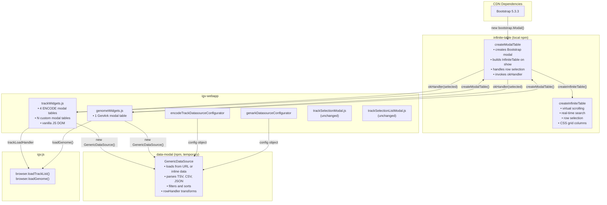
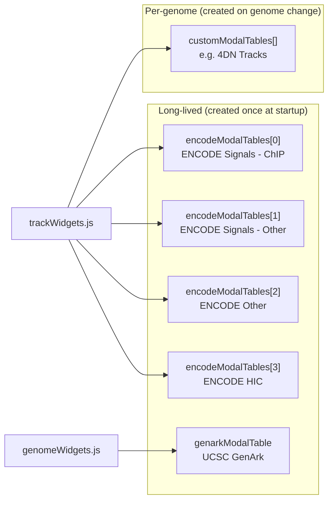
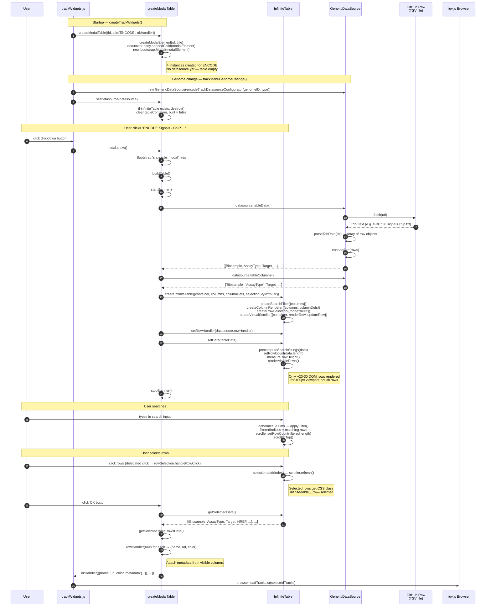
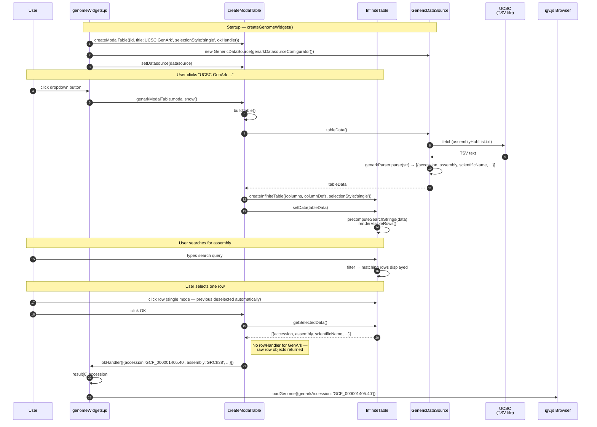
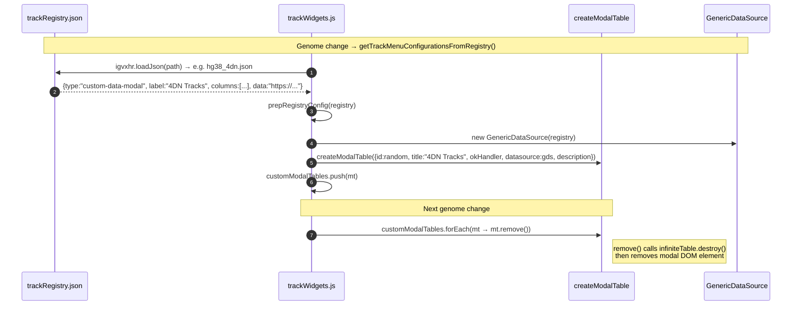
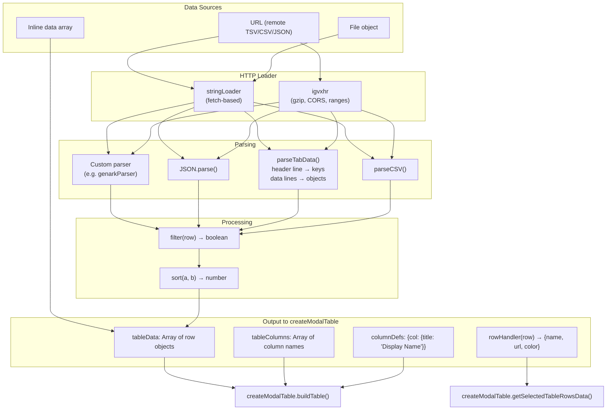
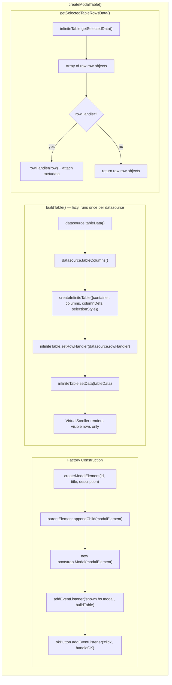
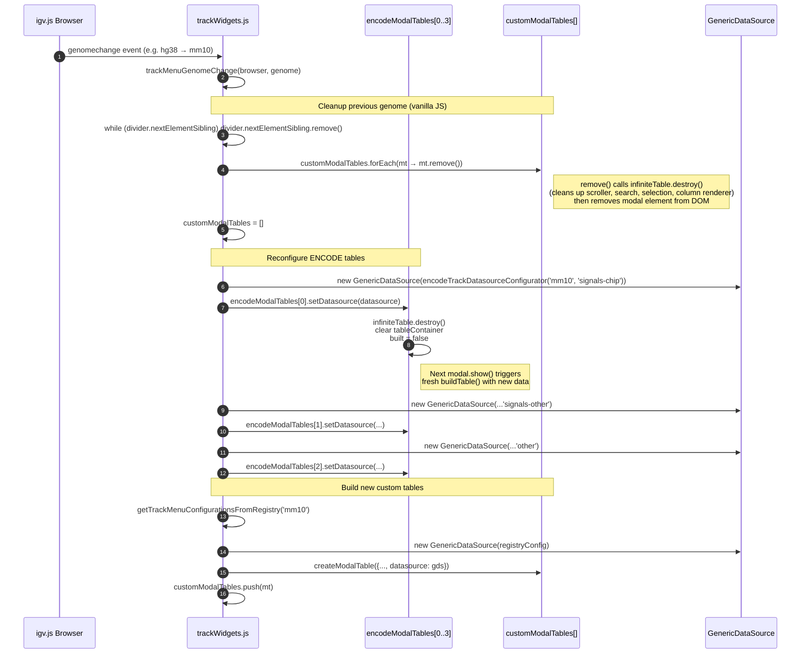

# igv-webapp ↔ InfiniteTable Interaction Diagrams

How InfiniteTable replaces jQuery DataTables in igv-webapp, eliminating jQuery and all DataTables dependencies. InfiniteTable is a zero-dependency, virtual-scrolling table component composed from four functional modules.

---

## 1. Architecture Overview

Two completely separate modal systems coexist for track/genome selection. InfiniteTable replaces the DataTables-based system; the other two are unchanged:

| Modal System | Library | Used For | Selection |
|---|---|---|---|
| **createModalTable** (InfiniteTable) | Zero-dependency virtual scroller | ENCODE tracks, GenArk genomes, custom-data-modal registries (e.g. 4DN) | Single or multi row click |
| **TrackSelectionModal** | Pure Bootstrap 5 | Track hubs, genome track registries with groups | Checkboxes with shift-select |
| **TrackSelectionListModal** | Pure Bootstrap 5 | Flat track lists (no groups) | HTML `<select multiple>` |

InfiniteTable has **no external dependencies** — no jQuery, no DataTables, no third-party libraries.



---

## 2. Dependency Chain

```
index.html (CDN)
├── Bootstrap 5.3.3 ──────────────── modal chrome (used by everything)
└── (no jQuery, no DataTables)

index.html (local CSS)
└── node_modules/infinite-table/css/infinite-table.css

package.json (npm)
├── infinite-table (file:../InfiniteTable)
│   ├── src/modalTable.js ─────────── Bootstrap modal wrapper for InfiniteTable
│   ├── src/infiniteTable.js ──────── virtual-scrolling table engine
│   ├── src/virtualScroller.js ────── O(1) scroll position → row index, DOM recycling
│   ├── src/searchFilter.js ───────── debounced real-time text search
│   ├── src/rowSelection.js ───────── single/multi selection state via Set
│   ├── src/columnRenderer.js ─────── CSS grid header/data row rendering
│   └── src/domUtils.js ──────────── minimal DOM helpers
│
└── data-modal v1.6.2 (temporary — only GenericDataSource used)
    ├── src/genericDataSource.js ───── data loading / parsing / transforms
    ├── src/dataWrapper.js ────────── line-by-line string iteration
    └── src/stringLoader.js ───────── default fetch()-based HTTP loader
```

jQuery is **completely eliminated** — no CDN script tag, no `$()` calls in trackWidgets.js. DataTables CSS and JS CDN links are removed.

---

## 3. InfiniteTable Internal Composition

InfiniteTable is built from four composable functional modules, each created via factory functions (no classes):

```mermaid
%%{init: {'themeVariables': {'fontSize': '16px'}}}%%
flowchart TB
    subgraph IT["createInfiniteTable()"]
        direction TB
        SF["createSearchFilter<br/>• <input> with debounced handler<br/>• pre-computed lowercase search strings<br/>• filters to matching row indices<br/>• ':selected' pseudo-query"]
        CR["createColumnRenderer<br/>• CSS grid layout<br/>• columnDefs title overrides<br/>• renderHeaderRow()<br/>• renderDataRow() / updateDataRow()"]
        RS["createRowSelection<br/>• Set-based index tracking<br/>• single mode: clear + add<br/>• multi mode: toggle<br/>• onSelectionChange callback"]
        VS["createVirtualScroller<br/>• sentinel div for total height<br/>• scrollTop ÷ rowHeight → visible range<br/>• DOM node pool + recycling<br/>• requestAnimationFrame throttle<br/>• only renders visible + buffer rows"]
    end

    SF -->|"filteredIndices"| IT
    CR -->|"renderRow / updateRow"| VS
    RS -->|"selection change → refresh"| VS

    body["body div (scrollable)"] --> VS
    click["click event (delegated)"] --> RS
```



### Component Responsibility Matrix

| Component | State Owned | DOM Created | Key Methods |
|---|---|---|---|
| **searchFilter** | `allData[]`, `searchStrings[]`, `filteredIndices[]` | `<input>` search box | `setData()`, `applyFilter()`, `getFilteredIndices()` |
| **columnRenderer** | `columns`, `columnDefs`, `gridTemplate` | Header row, data row cells | `renderHeaderRow()`, `renderDataRow()`, `updateDataRow()` |
| **rowSelection** | `selected: Set<index>` | (none — purely logical) | `handleRowClick()`, `isSelected()`, `getSelectedIndices()` |
| **virtualScroller** | `rowCount`, scroll position, DOM pool | Sentinel div, visible rows container | `setRowCount()`, `scrollToTop()`, `refresh()` |

---

## 4. ModalTable Instances — Who Creates What

Same instance lifecycle as before. Five to N instances; four long-lived ENCODE, one long-lived GenArk, zero or more ephemeral custom. The only change is `new ModalTable()` → `createModalTable()`.



### Lifecycle Details

| Instance | Created | DataSource Set | Destroyed |
|---|---|---|---|
| ENCODE (×4) | `createTrackWidgets()` via `createModalTable()` | `trackMenuGenomeChange()` via `setDatasource()` | Never (reused) |
| GenArk (×1) | `createGenomeWidgets()` via `createModalTable()` | Immediately after creation via `setDatasource()` | Never |
| Custom (×N) | `prepRegistryConfig()` via `createModalTable()` | At creation (datasource in config) | `trackMenuGenomeChange()` calls `remove()` |

---

## 5. ENCODE Track Selection — Full Sequence

The most common interaction. User browses ENCODE tracks with real-time search and virtual scrolling.



### InfiniteTable Configuration Generated

```javascript
createInfiniteTable({
    container: tableContainer,            // div inside modal body
    columns: ['Biosample', 'AssayType', 'Target', 'OutputType',
              'Format', 'Lab', 'Accession', 'Experiment', 'BioRep', 'TechRep'],
    columnDefs: {
        AssayType: { title: 'Assay Type' },
        OutputType: { title: 'Output Type' },
        BioRep: { title: 'Bio Rep' },
        TechRep: { title: 'Tech Rep' }
    },
    selectionStyle: 'multi'               // toggle selection on click
})
// Followed by:
//   infiniteTable.setRowHandler(datasource.rowHandler)
//   infiniteTable.setData(tableData)
```

---

## 6. GenArk Genome Selection — Full Sequence

Single-select variant. User picks one genome assembly from the UCSC GenArk catalog.



---

## 7. Custom Data Modal — Registry-Driven

Unchanged flow — only the table constructor call differs:



---

## 8. GenericDataSource — Data Loading Pipeline (Unchanged)

GenericDataSource is the same data layer from data-modal. It is not coupled to DataTables or InfiniteTable — it produces plain arrays and column lists that either can consume.



---

## 9. createModalTable Internals — What InfiniteTable Actually Does



### InfiniteTable Features vs DataTables Features

| Feature | DataTables (old) | InfiniteTable (new) |
|---|---|---|
| **Row display** | Pagination (`pageLength: 100`) | Virtual scrolling (all rows available, only visible rendered) |
| **Row selection** | DataTables Select extension + `.selected` CSS class | `createRowSelection` with `Set<index>` state |
| **Search/filter** | DataTables built-in search bar (present but unused) | `createSearchFilter` with debounced real-time search (functional) |
| **Horizontal scroll** | `scrollX: true` | CSS grid with `minmax(120px, 1fr)` columns |
| **Vertical scroll** | `scrollY: '400px'` | Virtual scroller — fixed-height body with O(1) row lookup |
| **Column titles** | `columns: [{title, data}]` config | `columnDefs: {col: {title: 'Display Name'}}` |
| **DOM weight** | All rows rendered + pagination controls | Only visible + buffer rows (~40-50 DOM nodes) |
| **Dependencies** | jQuery 3.5.1 + DataTables + Select extension (3 CDN scripts + 1 CDN CSS) | Zero external dependencies |
| **Data extraction** | `api.row(tr).index()` → `tableData[index]` | `selection.getSelectedIndices()` → `data[index]` |

---

## 10. Row Selection and Data Extraction — Detail

Same logical flow as before, but the mechanism changes from jQuery DOM queries to a `Set`-based index tracker:

```
User clicks rows in InfiniteTable
        │
        ▼
Delegated click on body div → event.target.closest('.infinite-table__row')
        │
        ▼
row.dataset.index → displayIndex → displayData[displayIndex] → originalIndex
        │
        ▼
rowSelection.handleRowClick(originalIndex)
        │
        ├── single mode: selected.clear() then selected.add(originalIndex)
        └── multi mode:  selected.has(originalIndex) ? delete : add
        │
        ▼
onSelectionChange → scroller.refresh() → re-render with .infinite-table__row--selected
        │
        ▼  User clicks OK button
        │
getSelectedTableRowsData()
        │
        ├── infiniteTable.getSelectedData()
        │       selection.getSelectedIndices() → sorted array of indices
        │       indices.map(i => data[i]) → raw row objects
        │
        ├── If rowHandler exists (ENCODE):
        │       rowHandler(row) → {name, url, color}
        │       Attach metadata: filtered columns from raw row
        │       Return: [{name, url, color, metadata: {Biosample, Target, ...}}, ...]
        │
        └── If no rowHandler (GenArk, custom):
                Return: [{accession, assembly, scientificName, ...}, ...]
        │
        ▼
okHandler(result)
        │
        ├── trackLoadHandler → browser.loadTrackList(result)     [ENCODE, custom]
        └── loadGenome({genarkAccession: result[0].accession})   [GenArk]
```

---

## 11. Modal DOM Structure

createModalTable generates this Bootstrap modal HTML. InfiniteTable renders inside `#${id}-table-container`.

```
<div id="${id}" class="modal fade">
  <div class="modal-dialog modal-xl">
    <div class="modal-content">

      <div class="modal-header">
        <div class="modal-title">${title}</div>
        <button class="btn-close" data-bs-dismiss="modal"/>
      </div>

      <div class="modal-body">
        <!-- Description slot -->
        <div style="font-size:0.9rem; padding-bottom:0.75rem">
          ${description HTML, e.g. ENCODE link}
        </div>

        <!-- Spinner (hidden by default) -->
        <div id="${id}-spinner" class="spinner-border" style="display:none"/>

        <!-- InfiniteTable renders here -->
        <div id="${id}-table-container">
          <div class="infinite-table">
            <div class="infinite-table__header">
              <input class="infinite-table__search" placeholder="Search..."/>
              <div class="infinite-table__header-row" style="display:grid">
                <!-- column header cells -->
              </div>
            </div>
            <div class="infinite-table__body" style="overflow-y:auto; height:400px">
              <div class="infinite-table__sentinel" style="height: totalRows × rowHeight">
                <div class="infinite-table__visible" style="transform: translateY(...)">
                  <!-- only visible + buffer rows rendered -->
                  <div class="infinite-table__row" data-index="...">
                    <!-- cells via CSS grid -->
                  </div>
                </div>
              </div>
            </div>
          </div>
        </div>
      </div>

      <div class="modal-footer">
        <button data-bs-dismiss="modal">Cancel</button>
        <button data-bs-dismiss="modal">OK</button>    ← triggers getSelectedTableRowsData
      </div>

    </div>
  </div>
</div>
```

---

## 12. Genome Change — DataSource Swap

Same sequence as before, but with InfiniteTable teardown/rebuild instead of DataTables:



---

## 13. Component Responsibilities

| Component | Location | Responsibility |
|---|---|---|
| **createModalTable** | infinite-table/src/modalTable.js | Bootstrap modal wrapper + InfiniteTable lifecycle + row selection extraction + okHandler dispatch |
| **createInfiniteTable** | infinite-table/src/infiniteTable.js | Composes scroller/search/selection/columns, manages data and display state |
| **createVirtualScroller** | infinite-table/src/virtualScroller.js | DOM pool recycling, sentinel height, visible range calculation, rAF throttle |
| **createSearchFilter** | infinite-table/src/searchFilter.js | Debounced text input, pre-computed search strings, index-based filtering |
| **createRowSelection** | infinite-table/src/rowSelection.js | Set-based single/multi selection, click handling, selection queries |
| **createColumnRenderer** | infinite-table/src/columnRenderer.js | CSS grid layout, columnDefs title overrides, row rendering/updating |
| **GenericDataSource** | data-modal/src/genericDataSource.js | Data loading (URL/inline/File), parsing (TSV/CSV/JSON/custom), filtering, sorting, row transformation |
| **encodeTrackDatasourceConfigurator** | js/widgets/encodeTrackDatasourceConfigurator.js | ENCODE-specific config: URL, columns, rowHandler, sort |
| **genarkDatasourceConfigurator** | js/widgets/genarkDatasourceConfigurator.js | GenArk-specific config: UCSC URL, columns, custom parser |
| **trackWidgets.js** | js/widgets/trackWidgets.js | Creates/manages ENCODE + custom modal tables, vanilla JS dropdown DOM, wires okHandler to `browser.loadTrackList()` |
| **genomeWidgets.js** | js/widgets/genomeWidgets.js | Creates/manages GenArk modal table, wires okHandler to `loadGenome()` |
| **trackSelectionModal.js** | js/widgets/trackSelectionModal.js | Non-InfiniteTable checkbox modal (unchanged) |
| **trackSelectionListModal.js** | js/widgets/trackSelectionListModal.js | Non-InfiniteTable select list modal (unchanged) |

---

## 14. What Changed vs What Stayed

```
            REPLACED                              KEPT AS-IS
       ┌─────────────────────┐            ┌────────────────────────┐
       │  ModalTable class   │            │  GenericDataSource     │
       │  → createModalTable │            │  • data loading        │
       │                     │            │  • parsing             │
       │  DataTables API     │            │  • filtering/sorting   │
       │  → InfiniteTable    │            │  • rowHandler          │
       │    (virtual scroll) │            │  • tableColumns()      │
       │                     │            │  • tableData()         │
       │  jQuery             │            └────────────────────────┘
       │  → vanilla JS       │            ┌────────────────────────┐
       │                     │            │  Datasource configs    │
       │  CDN dependencies   │            │  • encodeTrack...      │
       │  (3 scripts, 1 CSS) │            │  • genark...           │
       │  → 0 CDN, 1 local   │            │  • registry JSON files │
       │    CSS              │            └────────────────────────┘
       └─────────────────────┘            ┌────────────────────────┐
                                          │  Consumer code shape   │
                                          │  • trackWidgets.js     │
                                          │  • genomeWidgets.js    │
                                          │  (okHandler wiring,    │
                                          │   setDatasource calls) │
                                          └────────────────────────┘
```

---

## 15. Side-by-Side Comparison: DataTables vs InfiniteTable

### API Mapping

| Operation | DataTables (old) | InfiniteTable (new) |
|---|---|---|
| Create table instance | `new ModalTable(config)` | `createModalTable(config)` |
| Config: pagination | `pageLength: 100` | *(removed — virtual scrolling replaces pagination)* |
| Config: selection mode | `selectionStyle: 'single'` | `selectionStyle: 'single'` *(same)* |
| Swap data source | `mt.setDatasource(ds)` | `mt.setDatasource(ds)` *(same)* |
| Update description | `mt.setDescription(html)` | `mt.setDescription(html)` *(same)* |
| Remove from DOM | `mt.remove()` | `mt.remove()` *(same)* |
| Show modal | `mt.modal.show()` | `mt.modal.show()` *(same)* |
| Get selected data | *internal via `$('tr.selected')`* | *internal via `infiniteTable.getSelectedData()`* |

### Dropdown DOM Manipulation (trackWidgets.js)

| Operation | jQuery (old) | Vanilla JS (new) |
|---|---|---|
| Find dropdown menu | `$('#igv-app-track-dropdown-menu')` | `document.getElementById('igv-app-track-dropdown-menu')` |
| Find divider | `$dropdownMenu.find('#igv-app-annotations-section')` | `document.getElementById('igv-app-annotations-section')` |
| Remove siblings | `$divider.nextAll().remove()` | `while (divider.nextElementSibling) divider.nextElementSibling.remove()` |
| Create button | `$('<button>', {class:..., type:...})` | `document.createElement('button')` + property assignment |
| Insert after | `$button.insertAfter($divider)` | `divider.insertAdjacentElement('afterend', button)` |
| Click handler | `$button.on('click', fn)` | `button.addEventListener('click', fn)` |

### Performance Characteristics

| Aspect | DataTables | InfiniteTable |
|---|---|---|
| DOM nodes for 10,000 rows | ~10,000 `<tr>` elements (paginated view shows 100) | ~40–50 `<div>` elements (visible + buffer) |
| Initial render | Renders all rows into DOM, then paginates | Renders only visible viewport |
| Search | DataTables built-in (full re-render) | Pre-computed lowercase strings, index-based filter, no DOM rebuild |
| Scroll performance | Native table scroll (all rows in DOM) | requestAnimationFrame + DOM node recycling |
| Memory | Full DOM tree + DataTables internal state | Minimal DOM + flat arrays + Set for selection |

### CDN / Bundle Impact

| Resource | DataTables (old) | InfiniteTable (new) |
|---|---|---|
| jQuery 3.5.1 slim | 70 KB min | **Removed** |
| DataTables 1.10.20 | 80 KB min | **Removed** |
| DataTables Select 1.3.1 | 15 KB min | **Removed** |
| DataTables CSS | 8 KB | **Removed** |
| InfiniteTable JS | — | ~6 KB (bundled into app via rollup) |
| InfiniteTable CSS | — | ~2 KB |
| **Net change** | ~173 KB CDN | **~8 KB local** (bundled) |
