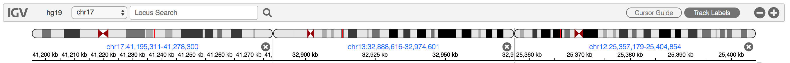

# Quick Start

### 1. Open the IGV-Web app

In a [web browser](#supported-browsers), navigate to <https://igv.org/app>.  

### 2. Load a reference genome
IGV displays data mapped to the genomic coordinates of a reference genome. When the IGV-Web page first loads, it will load the default reference genome **hg19**. To load a different genome, click on the `Genome` dropdown menu and either select from the list of pre-defined genomes, or use one of the options to load a genome sequence file that you specify.

> Note: You must first load the reference genome, before loading data tracks. Switching genomes will clear out any loaded tracks.

#### Selecting a pre-defined genome

The available pre-defined genomes are listed at the top of the menu. If you select any of these genomes, a corresponding gene annotation track will also be loaded.

> Note: The menu includes the complete list of pre-defined genomes. Unlike IGV-Desktop, there is no `More...` entry at the bottom of the menu to access a longer list.

#### Loading a genome file

If you have a FASTA file of your reference genome sequence, you can load it using one of the options in the bottom part of the menu: 

* `Local File`
* `Dropbox`
* `Google Drive`
* `URL`

Selecting the `URL` option will present a dialog to enter the full web link URL to the FASTA file and to the corresponding index file. For the other options, both the FASTA file and the index file must be selected from the file chooser that pops up.

> **Note:** A FASTA file only has the sequence data and IGV cannot display the cytoband ideogram in the chromosome ruler or automatically load a corresponding gene annotation track. You can load a genome annotation file directly via the `Load Track` menu.

You will be prompted to sign into a Google account if you select the `Google Drive` option, and a [Dropbox](https://www.dropbox.com) account is needed for the `Dropbox` option. 

> **Developers:** Another option is to create and load a .json genome file, which can include references to a cytoband file and a default gene annotation track. See the [igv.js developer documentation](https://github.com/igvteam/igv.js/wiki/Reference-Genome-2.0).

### 3. Load data tracks

To load data and genomic annotations, click on the `Load Track` dropdown menu and either select from the selection of pre-defined tracks or choose one of the options to load files that you specify.

#### Selecting a pre-defined track

The available pre-defined track sources are listed at the bottom of the menu. Clicking on a source will open a list of datasets from that source. For example, if `ENCODE` is one of the menu items, clicking on it will bring up a table of datasets available from the ENCODE data portal (Encyclopedia of DNA Elements, <https://www.encodeproject.org>). 
 
See information on the available [data sources](./dataSources.html). 

> **Note:** The list of pre-defined track sources varies depending on the current reference genome. Some genomes do not come with any pre-defined tracks. 

#### Loading a track file

To load track data from a file, use one of the options in the top part of the menu: 

* `Local File`
* `Dropbox`
* `Google Drive`
* `URL`

Selecting the `URL` option will present a dialog to enter the full web link URL to one data file and the corresponding index file, if there is one. For the other options, a file chooser pops up and you can select files for mulitple tracks, along with the corresponding index files. 

You will be prompted to sign into a Google account if you select the `Google Drive` option, and a [Dropbox](https://www.dropbox.com) account is needed for the `Dropbox` option. 

See information on supported [file types](./fileFormats.html). 

> **Note:** Make sure to load only data files that correspond to the current reference genome. In general, a genomic data file does not include information about the genome it aligns to, which means IGV cannot automatically check if they match.

### 4. Navigate

IGV-Web provides several navigation controls for specifying the genomic region to view. A ruler indicating the extent of the current region is displayed below the toolbar, and the size of the region and its genomic coordinates are displayed in the toolbar.

* **Select a chromosome.** The chromosome dropdown menu in the toolbar includes an entry for every chromosome or contig in the current reference genome. Selecting a chromosome from the menu will set the view to include the whole chromosome. The ruler also includes a cytoband ideogram if you selected one of the pre-defined reference genomes.

* **Select chromosome "all"**. At the top of the list of chromosomes in the dropdown menu there is also the special entry `all` to view the whole genome, with all the chromosomes layed out side-by-side. 
   
	* Clicking on a chromosome in the whole-genome ruler will set the view to that chromosome, just like selecting the chromosome from the dropdown menu.

* **Enter genomic coordinates.** In the text box where the genomic coordinates are displayed, you can type the coordinates of the region you want to view (e.g. *chr17:41,195,312-41,278,500*). The thousands separator is optional, but the chromosome name is required. 

* **Search by gene name.** In the text box where the genomic coordinates are displayed, type the name of a gene (e.g. *BRCA1*) and hit return or click on the magnifying glass. IGV will look up the genomic coordinates for that gene and set the viewing region accordingly. *Currently for human and mouse genomes only.*

* **Enter multiple loci.** In the text box, you can enter multiple regions by gene name, genomic coordinates, or a mixture of the two, separated by spaces (e.g. *BRCA2 BRCA2 KRAS*). This will split up the IGV view into multiple panels and display the regions side-by-side, each with its own ruler. 
   
	* Clicking on the blue genomic coordinates in the ruler of any of the panels will change the view to only that region.
	* Close a panel by clicking on the **X** on the right edge of its ruler.
 
* **Zoom and pan.** 
	* Use the **+** and **-** buttons on the right end of the toolbar to zoom in and out. In multi-locus view, this will affect all the panels. *Not available in whole-genome view*.
	 
	* Double-click in any of the data tracks to zoom in one level. The new view will be centered around the point where you clicked.
	
	* Click and drag in the ruler to sweep out a region to zoom into.
	
	* Click on the cytoband ideogram to move the view to that locus without changing the zoom level.
	
	* In any of the data tracks, click and drag (left or right) to pan the view across the genome. 

# Sessions
To save the state of your IGV session, you can bookmark the page in your browser or create a web link URL that you can share with others or save for your own later use. 

### Bookmark a session
To bookmark the current state of the IGV page in your browser, first click on the `Bookmark` button in the IGV-Web app. This will update the URL in the browser's address bar. Then you can use your browser to save a bookmark for the page (in most browsers use `Command+D` on MacOS, `Ctrl+D` on Windows). 

### Share a session
To create a web link URL that will open the IGV-Web app with all the same data tracks and settings as the current session, click on the `Share` button. A dialog will pop up and display a short URL that encodes the current state of the IGV session.

* Use the `COPY` button to copy the URL to the clipboard and paste it wherever you want for safe keeping. 
* Alternatively, the `Tweet` and `EMAIL` buttons provide shortcuts for sending the URL to others. 
* The `EMBED` button generates an HTML code snippet that can be used to add the session to a web page. 
* The `QR CODE` button generates a QR two-dimenionsal barcode for the URL.

### Restore a session
To restore a bookmarked session, use your browser's mechanism for going back to a bookmarked page.

To restore a session from URL, paste it into a browser address bar, or click on the URL in an email message, tweet, etc.

Be aware that a session includes pointers to the data files for any loaded tracks. So to fully restore a session, you must have access to the same files that were loaded when the session was saved.

> **Note:** Due to security restrictions on web browsers, if you loaded any files from the local file system, IGV cannot automatically load them for you when you restore the session **even if you run the session in the same environment on the same computer** where you saved the session. The app will warn you if a restored session includes pointers to local files.

# More about tracks

### Moving and deleting tracks
When you load a track it will be added to the bottom of the IGV track panel. To change the track order, just click on the grey grab-bar on the right edge of the track and drag it up or down to the new location.

To remove a track from the IGV browser, click on the gear icon to the right of the track and select `Remove track` from the menu that pops up. 

> **Note:** Removing a track does not just hide the track. If you want to show it again you must reload the data file.  

Refreshing the page at www.igv.org/app will clear all loaded data and genomes and start a new session. Or if you launched IGV-Web from a saved session, refreshing the page will go back to the initial session state.

### Setting other attributes
Clicking on a track's gear menu reveals a number of attributes, depending on the type of file that was loaded into the track. For example, for a track displaying paired-end sequence alignments from a BAM file, the menu includes an option `View as pairs`. In addition to `Remove track`, all tracks will include the menu items `Set track name` and `Set track height`.

# The sequence track

When zoomed in sufficiently, the reference genome sequence track appears just below the chromosome ruler. Depending on the zoom level, the sequence is represented by colored bars: 
 
or colored letters: 

with adenine (A) in green, cytosine (C) in blue, guanine (G) in yellow, and thymine (T) in red.

### Sequence track attributes

The sequence track cannot be removed, but it can be dragged to a different position just like any other track.

The gear menu for sequence tracks includes two options:

* **Strand direction.** Initially, the forward / positive strand is displayed. Click on `Reverse` to flip to the reverse / negative strand. Click on `Forward` to change it back.

* **Sequence translation.** Click on `Three-frame Translate` to display a 3-band track that shows a 3-frame translation of the amino acid sequence for the corresponding nucleotide sequence. The translation is shown for the current strand. Amino acids are displayed as blocks colored in alternating shades of gray. Methionines are colored green, and all stop codons are colored red. When you zoom all the way in, the amino acid symbols will appear. Click on `Close Translation` to collapse the track to display the sequence only.

# Supported browsers

IGV-Web requires a modern web browser with support for Javascript ECMAScript 2015. We test on the latest versions of Chrome, Safari, Firefox, and Edge. Internet Explorer (IE) is not supported.

