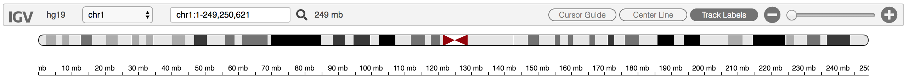
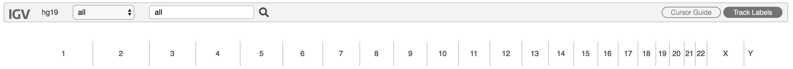
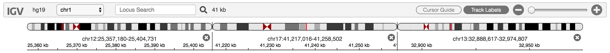
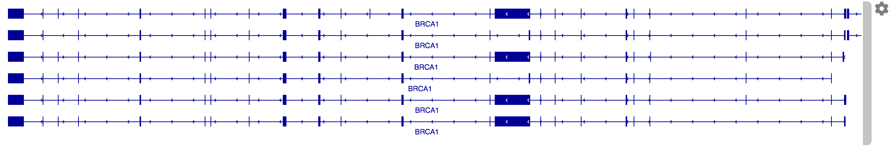
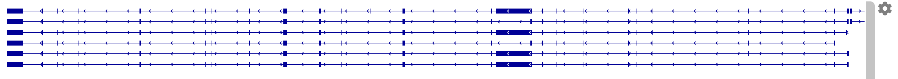

# About IGV-Web

IGV-Web is a web application for exploring genomic datasets. Data can be loaded directly from a user’s local file system, or via URL from web servers and cloud providers. The application runs only in the web browser and no data is ever uploaded to the host site.

IGV-Web is developed by the same team that develops the IGV desktop application. Links to all versions of IGV can be found at <https://igv.org>.

> **Developers:** IGV-Web is implemented using igv.js, our JavaScript component for embedding IGV in web pages. All IGV code is open source and available at <https://github.com/igvteam>

# Quick Start

### 1. Open the IGV-Web app

In a [web browser](#supported-browsers), navigate to <https://igv.org/app>.   

> **Note:** Make sure that popups are not disabled in your web browser as some features rely on them. For example, loading tracks and genomes from files in Google Drive may pop up a login window. Also note that some options may not be available if cookies have been disabled in the web browser preferences.

### 2. Load a reference genome
IGV displays data mapped to the genomic coordinates of a reference genome. When the IGV-Web page first loads, it will load the default reference genome **hg19**. To load a different genome, click on the `Genome` dropdown menu and either select from the list of pre-defined genomes, or use one of the options to load a genome sequence file that you specify.

> **Note:** You must first load the reference genome, before loading data tracks. Switching genomes will clear out any loaded tracks.

#### Selecting a pre-defined genome

The available pre-defined genomes are listed in the menu. If you select any of these genomes, a corresponding gene annotation track will also be loaded.

> Note: The menu includes the complete list of available pre-defined genomes. Unlike IGV-Desktop, there is no `More...` entry at the bottom of the menu to access a longer list.

#### Loading a genome sequence file

If you have an indexed FASTA file of your reference genome sequence, you can load it using one of the options in the top part of the menu: 

* `Local File`
* `Dropbox`
* `Google Drive`
* `URL`

Selecting the `URL` option will present a dialog where you enter the full web link URL to the FASTA file and to the corresponding index file. For the other options, both the FASTA file and the index file must be selected from the file chooser that pops up.

> **Note:** A FASTA file only has the sequence data and IGV cannot display the cytoband ideogram in the chromosome ruler or automatically load a corresponding gene annotation track. You can load a gene annotation file directly via the `Tracks` menu.

You will be prompted to sign into a Google account if you select the `Google Drive` option, and a [Dropbox](https://www.dropbox.com) account is needed for the `Dropbox` option. The `Google Drive` option will not be presented if cookies are disabled in the web browser.

> **Developers:** Another option is to create and load a .json genome file, which can include references to a cytoband file and a default gene annotation track. See the [igv.js developer documentation](https://github.com/igvteam/igv.js/wiki) for details on creating a reference genome object in JSON format.

### 3. Load data tracks

To load data and genomic annotations, click on the `Tracks` dropdown menu and either select from the selection of pre-defined tracks or choose one of the options to load files that you specify.

#### Selecting a pre-defined track

Categories of available pre-defined tracks are listed in the menu. Clicking on a category will open a list of datasets. For example, if `ENCODE` is one of the menu items, clicking on it will bring up a list of datasets available from the ENCODE data portal (Encyclopedia of DNA Elements, <https://www.encodeproject.org>). 

> **Note:** The set of pre-defined tracks presented in the menu varies depending on the current reference genome. Some genomes do not come with any pre-defined tracks. 

#### Loading a track file

To load track data from a file, use one of the options in the top part of the menu: 

* `Local File`
* `Dropbox`
* `Google Drive`
* `URL`

Selecting the `URL` option will present a dialog where you enter the full web link URL to one data file and the corresponding index file, if there is one. For the other options, a file chooser pops up and you can select files for mulitple tracks, along with the corresponding index files. 

> **Note:** For indexed files, e.g. BAM files, you must explicitly select the index file along with the data file. If you also use IGV-Desktop, you may be used to IGV automatically finding and loading the index file. This is not always possible from a web browser, so the behavior is different in IGV-Web.

You will be prompted to sign into a Google account if you select the `Google Drive` option, and a [Dropbox](https://www.dropbox.com) account is needed for the `Dropbox` option. The `Google Drive` option will not be presented if cookies are disabled in the web browser.

See information on supported [file types](./fileFormats.html). 

> **Note:** Make sure to load only data files that correspond to the current reference genome. In general, a genomic data file does not include information about the genome it aligns to, which means IGV cannot automatically check if they match.

### 4. Navigate

IGV-Web provides several navigation controls for specifying the genomic region to view. A ruler indicating the extent of the current region is displayed below the toolbar, and the size of the region and its genomic coordinates are displayed in the toolbar.

* **Select a chromosome.** The chromosome dropdown menu in the toolbar includes an entry for every chromosome or contig in the current reference genome. Selecting a chromosome from the menu will set the view to include the whole chromosome. The ruler also includes a cytoband ideogram if you selected one of the pre-defined reference genomes.

* **Select chromosome "all"**. At the top of the list of chromosomes in the dropdown menu there is also the special entry `all` to view the whole genome, with all the chromosomes layed out side-by-side. Or you can enter `all` in the text box where the genomic coordinates are displayed.
   
	* Clicking on a chromosome in the whole-genome ruler will set the view to that chromosome, just like selecting the chromosome from the dropdown menu.

* **Enter genomic coordinates.** In the text box where the genomic coordinates are displayed, you can type the coordinates of the region you want to view (e.g. *chr17:41,195,312-41,278,500*). The thousands separator is optional, but the chromosome name is required. 

* **Search by gene name.** In the text box where the genomic coordinates are displayed, type the name of a gene (e.g. *BRCA1*) and hit return or click on the magnifying glass. IGV will look up the genomic coordinates for that gene and set the viewing region accordingly. *Currently supported for human and mouse genomes only.*

* **Enter multiple loci.** In the text box, you can enter multiple regions by gene name, genomic coordinates, or a mixture of the two, separated by spaces (e.g. *BRCA2 BRCA2 KRAS*). This will split up the IGV view into multiple panels and display the regions side-by-side, each with its own ruler. 
   
	* Clicking on the genomic coordinates above the ruler of any of the panels will change the view to only that region.
	* Close a panel by clicking on the **X** on the right edge of its ruler.
 
* **Zoom and pan.** 
	* Use the zoom slider or the **+** and **-** buttons on the right end of the toolbar to zoom in and out. In multi-locus view, this will affect all the panels. *The zoom controls are not available in whole-genome view*.
	> **Note:** If your browser window is narrow, the **+** and **-** buttons appear without the slider widget.
	 
	* Double-click in any of the data tracks to zoom in one level. The new view will be centered on the point where you clicked.
	
	* Click and drag in the ruler to sweep out a region to zoom into.
	
	* Click on the cytoband ideogram to move the view to that locus without changing the zoom level.
	
	* In any of the data tracks, click and drag (left or right) to pan the view across the genome. 

# More about tracks

### Moving and deleting tracks
When you load a track it will be added to the bottom of the IGV track panel. To change the track order, just click on the grey grab-bar on the right edge of the track and drag it up or down to the new location.

To remove a track from the IGV browser, click on the gear icon to the right of the track and select `Remove track` from the menu that pops up. 

> **Note:** Removing a track does not just hide the track. If you want to show it again you must reload the data file.  

Loading a new reference genome will also delete all loaded data tracks. Refreshing the IGV-Web page in the browser will delete all loaded data and reset to the default reference genome. Or, if you launched IGV-Web from a shared URL or browser bookmark, refreshing the page will go back to the initial session state defined by the URL or bookmark. 

### Track attributes: the gear menu
Clicking on a track's gear menu reveals a number of attributes. The set of attributes is determined by the type of file that was loaded into the track. For example, for a track displaying paired-end sequence alignments from a BAM file, the menu includes an option `View as pairs`. In addition to `Remove track`, all tracks will include the menu items `Set track name` and `Set track height`.

### Track actions: the popup menu
Right-clicking on a data track brings up a popup menu with actions you can perform. The set of menu items is determined by the type of file that was loaded into the track. For example, for a track displaying copy number data from a multi-sample SEG file, the menu includes an option `Sort by value`, which sorts the samples by copy number value at the locus where you clicked on the track. The sort order is toggled on each selection.

# Special tracks

### Sequence track

When zoomed in sufficiently, the reference genome sequence track appears just below the chromosome ruler. Depending on the zoom level, the sequence is represented by colored bars: 
 
or colored letters: 

with adenine (A) in green, cytosine (C) in blue, guanine (G) in yellow, and thymine (T) in red.

The gear menu for sequence tracks includes two options:

* **Strand direction.** Initially, the forward / positive strand is displayed. Click on `Reverse` to flip to the reverse / negative strand. Click on `Forward` to change it back.

* **Sequence translation.** Click on `Three-frame Translate` to display a 3-band track that shows a 3-frame translation of the amino acid sequence for the corresponding nucleotide sequence. The translation is shown for the current strand. Amino acids are displayed as blocks colored in alternating shades of gray. Methionines are colored green, and all stop codons are colored red. When you zoom all the way in, the amino acid symbols will appear. Click on `Close Translation` to collapse the track to display the sequence only.

The sequence track cannot be removed, but it can be dragged to a different position, just like any other track.

### Gene annotation track

If you load a reference genome from the list of hosted genomes provided in the `Genome` menu, a special gene annotation track is also automatically loaded. For most of the hosted genomes, these annotations are from NCBI's Reference Sequence Database (RefSeq). You cannot remove this track, but it will be automatically unloaded if you select a different reference genome.

When you load a data track, it will be positioned just above this gene annotation track. So by default, the gene annotations are always displayed at the bottom. You can however move the gene annotation track at any time by dragging it to a different position, just like any other track. 

By default, the annotations are displayed in a compact mode, where overlapping transcripts are collapsed into a single line:

The track gear menu provides two different options for expanding the display to show the overlapping features on separate lines: 

> **Note:** Changing the display mode does not affect the track height. A scrollbar will be added to the track if it is too short to display all the lines. To increase or decrease the track height, select `Set track height` from the gear menu.  

# Saving Sessions
IGV-Web has a number of options for saving the state of your IGV session: you can save a file in IGV session format, bookmark the page in your browser, or create a web link URL that you can share with others. 

Be aware that the saved state of an IGV session includes pointers to the data files for any loaded tracks. So to fully restore the state, you must have access to the same files that were loaded when the IGV session was saved.

> **Note:** Due to security restrictions on web browsers, if you loaded any files from the local file system, IGV cannot automatically load them for you when you restore the session **even if you run the session in the same environment on the same computer** where you saved the session. 

### Session files
To save a file that contains the state of the current IGV session, click on the `Session` dropdown menu, select `Save`, and enter a filename into the dialog that pops up. The filename must have the .json suffix, or it will not be recognized as a session file when later loaded into IGV-Web. Depending on your web browser settings, the file will be saved to your default downloads folder or you will be prompted to specify a destination folder. 

You can share your session with others, for example by emailing it to them, or copying the saved file to a shared file system, or uploading it to Dropbox, Google Drive, or a web server.

To restore a session from a saved file, click on the `Session` dropdown menu and select one of the options in the top part of the menu: 

* `Local File`
* `Dropbox`
* `Google Drive`
* `URL`

Selecting the `URL` option will present a dialog to enter the full web link URL to the session file. For the other options, a file chooser pops up. If you select the `Google Drive` option, you will be prompted to sign into a Google account, and a [Dropbox](https://www.dropbox.com) account is needed for the `Dropbox` option. The `Google Drive` option will not be presented if cookies are disabled in the web browser.

#### Session files from IGV-Desktop
Session files that were saved in the Java desktop version of IGV can also be loaded into IGV-Web via the `Session` dropdown menu. However, IGV-Desktop supports more features and file types than the IGV-Web app, and so the session may not be completely restored. Also note that session files saved in IGV-Web currently cannot be loaded into IGV-Desktop.

### Bookmarks
To bookmark the current state of the IGV page in your web browser, first click on `Bookmark` in the IGV-Web menu bar. This will update the URL in the web browser's address bar. Then you can use your browser to save a bookmark for the page (in most web browsers use `Command+D` on MacOS, `Ctrl+D` on Windows). 

To restore a bookmarked session, use your browser's mechanism for going back to a bookmarked page.

### Shareable links
To create a web link URL that will open the IGV-Web app with all the same data tracks and settings as the current session, click on `Share` in the menu bar. A dialog will pop up and display a short URL that encodes the current state of the IGV session.

* Use the `COPY` button to copy the URL to the clipboard and paste it wherever you want for safe keeping. 
* Alternatively, the `Tweet` and `EMAIL` buttons provide shortcuts for sending the URL to others. 
* The `EMBED` button generates an HTML code snippet that can be used to add the session to a web page. *Note: For the EMBED option, tracks loaded from Google Drive will only work if they are publicly available.*
* The `QR CODE` button generates a QR two-dimenionsal barcode for the URL.

To restore a session from URL, paste it into a browser address bar, or click on the URL in an email message, tweet, etc.

# Saving Images

Two options are provided for saving images from the IGV-Web app: 

* Click on `Save SVG` in the app menu bar to create an image that includes all the data tracks as currently displayed, as well as the ruler and cytoband ideogram. The image file will be saved in SVG format, a scalable vector format that is useful for creating figures for publication. 
* You can save the image of an individual track via the track *popup menu*. Select SVG or PNG format. 

Depending on your web browser settings, the image files will be saved to your default downloads folder or you will be prompted to specify a destination folder. 

# Circular View
(Introduced in IGV-Web version 1.9.0) In collaboration with the JBrowse development team, we integrated the JBrowse 2 circular view component for exploring structural variants, chromatin interactions, and other long-distance interactions. Currently this integration supports structural variants from VCF files, paired-end and split-read alignments from BAM/CRAM files, and interaction pairs from bedPE and interact tracks. See [here](https://github.com/igvteam/igv-webapp/wiki/Circular-View) for more information about using the circular view with IGV-Web. The circular view will not be available if the web browser preferences have been set to disable all cookies.

# Help Menu

The `Help` dropdown menu provides links to:

* This online documentation.
* The IGV **user forum**, where you can post support questions, bug reports, feature requests and other suggestions.
* The **GitHub repository** that hosts the IGV-Web source code. It provides another means of reaching the IGV team for support (via Git issues), and it includes documentation on how to host a local installation of the IGV-Web app.
* IGV-Web version information.

# Supported Browsers

IGV-Web requires a modern web browser with support for JavaScript ECMAScript 2015. We try to test on the latest versions of Chrome, Safari, Firefox, and Edge. The Internet Explorer (IE) browser is not supported.

*GitHub Pages theme adapted from [mattgraham](https://twitter.com/mattgraham)* 
